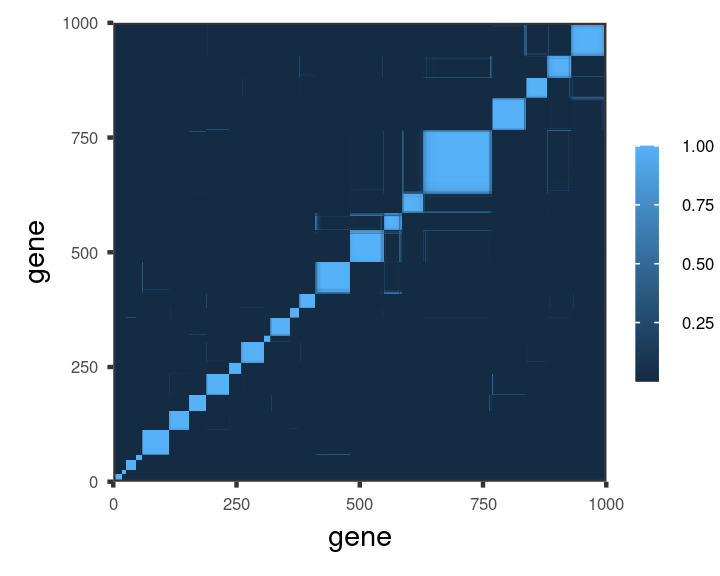

This folder uses a regression model to cluster time-course gene expression data. 

To download the data, clone the https://github.com/NelleV/genomic_time_series_bnp repository, 
and then 
1. Run ``make`` in ``genomic_time_series_bnp/data/``.
2. Then run `make all` in
   ``genomic_time_series_bnp/src/exploratory_analysis/``.

A few example genes are shown below. 
<figure>

    <figcaption> 
        In blue are the raw observations, while grey is a fitted smoother. 
        Red are samples from the smoother error distribution. 
    </figcaption> 
</figure>

The inferred co-clustering matrix is
<figure>

</figure>

In the notebooks found in the `jupyter` subdirectory, we examine the sensitivity of this matrix 
to various perturbations. 