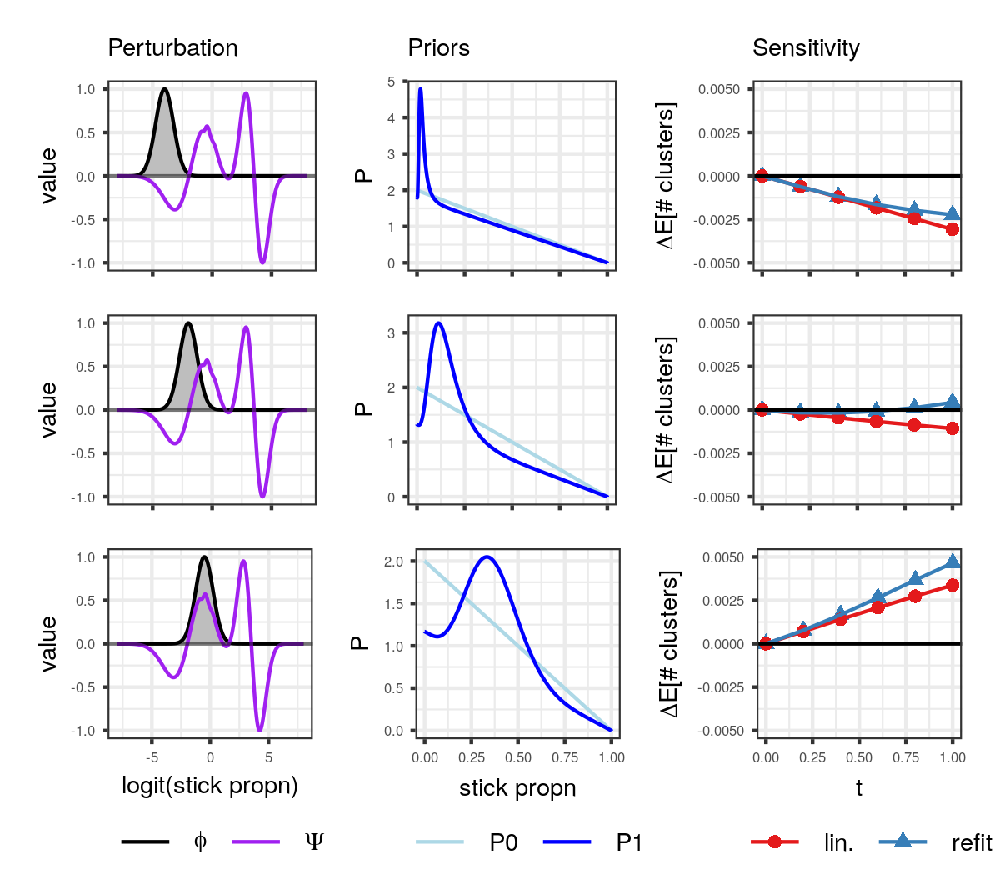

# BNP sensitivity

This repository contains the code to reproduce the results shown in

Ryan Giordano, Runjing Liu, Michael I. Jordan, Tamara Broderick. 
"Evaluating sensitivity to the Stick Breaking Prior in Bayesian Nonparametrics."
*arXiv link coming soon*

We evaluated local sensitivity to three data analysis problems:

1. a Gaussian mixture model of the canonical iris data set; 
2. a regression model of time-course gene expression data; 
3. and a topic model for inferring population structure from genetic data. 

## Installation

To install the package used for all the models we consider: 
```
pip install BNP_modeling
```

Dependencies include [jax](https://jax.readthedocs.io/en/latest/index.html) and the [jax branch of paragami](https://github.com/rgiordan/paragami/tree/jax). 
These will be installed automatically with the command above. 

Our experiments are contained in the `./GMM_clustering/`, `GMM_regression_clustering` and `./structure/` folders.
To install libraries specific to those experiments, run

```
pip install GMM_clustering
pip install GMM_regression_clustering
pip install structure
```
respectively. 

## Results

The results presented in our main paper are produced entirely within Jupyter notebooks. 
In each expreriment folder (`./GMM_clustering/`, `GMM_regression_clustering` and `./structure/`), 
the `jupyter` subfolder contains notebooks to reproduce our results. 
Specifically, see the `main_*.ipynb` files.  

For example, the [./GMM_clustering/jupyter/main_functional_sensitivity.ipynb](https://github.com/Runjing-Liu120/BNP_sensitivity/blob/master/GMM_clustering/jupyter/main_functional_sensitivity.ipynb)
file reproduces the functional sensitivity results for our GMM/iris epxeriment (Figure 6 in the paper). 

<figure>

    <figcaption> 
        The sensitivity of the expected number of in-sample clusters in the iris
data set to three multiplicative perturbations. (Left) the
multiplicative perturbation in grey. The influence function in purple
(Middle) the original prior density p0
and the perturbed prior density p1. (Right) the
effect of the perturbation on the change in expected number of in-sample
clusters.
    </figcaption> 
</figure>

