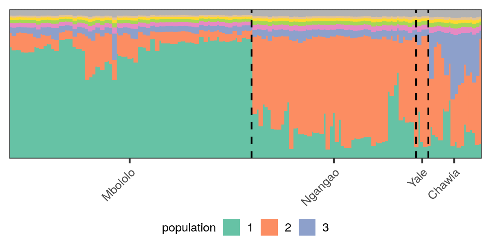

This directory constains the experiments on a topic model of genetic data. 

We study a publically available data set of Taita Thrush, an endagered bird species in Kenya. 

To download the data, 

````
cd ./data/thrush_data/ # move to data directory
./get_thrush_data.sh # download the data
````

The results are found in the `jupyter` folder. The initial fit is shown below
(see `./jupyter/main_parametric_sensitivity.ipynb`). 
<figure>

    <figcaption> 
        The inferred individual admixtures. Each vertical
strip is an individual and each color a latent population. Lengths of colored
segments represent the inferred admixture proportions. Individuals are
ordered by the geographic region from which they were sampled (Mbololo,
Ngangao, Yale, and Chawia). 
    </figcaption> 
</figure>

